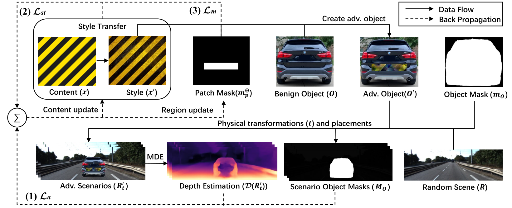

# MDE_Attack

本仓库包含一套经过定制修改的实验流程，用于生成面向单目深度估计相关感知任务的物理对抗补丁。当前主要可运行入口为 `DeepPhotoStyle_pytorch/test.py`，它结合了：

- 补丁区域的掩码风格迁移，
- 车辆或目标与道路场景的合成，
- 基于 YOLO 反馈的对抗优化，
- 可选的随机场景和随机位置训练，
- TensorBoard 日志与结果可视化导出。

当前代码已经不是原始 ECCV 2022 发布版本的原样代码。本说明文档描述的是这个工作区里目前实际使用的项目结构与运行方式。



## 上游来源与本地修改说明

本项目基于 ECCV 2022 论文 "Physical Attack on Monocular Depth Estimation in Autonomous Driving with Optimal Adversarial Patches" 的公开研究代码，并在此基础上进行了面向本地实验的进一步修改。

相较于原始参考实现，这个工作区包含了多项自定义改动，例如：

- 以 `DeepPhotoStyle_pytorch/test.py` 作为当前主要实验入口，
- 增加了基于 YOLO 的优化与评估逻辑，
- 增加了颜色相关掩码与损失项，
- 调整了日志、实验脚本和辅助工具，
- 修改了本地数据集路径、资源组织方式和输出结构。

如果你后续复用本仓库，建议明确说明这是一个基于上游代码修改而来的派生版本，而不是原始仓库的未改动副本。

## 项目结构

```text
MDE_Attack/
├─ DeepPhotoStyle_pytorch/
│  ├─ test.py                  # 当前主入口
│  ├─ model.py                 # 优化主循环与损失组合
│  ├─ image_preprocess.py      # 图像、掩码、场景预处理
│  ├─ my_utils.py              # 路径、掩码工具、图像保存/加载辅助函数
│  ├─ attach_cars.py           # 将目标以固定/随机位置贴入场景
│  ├─ dataLoader.py            # 基于 KITTI 的随机场景训练数据加载器
│  ├─ my_yolov5/               # YOLOv5 的图像/张量推理封装
│  ├─ asset/
│  │  ├─ src_img/
│  │  │  ├─ style/
│  │  │  ├─ content/
│  │  │  ├─ car/
│  │  │  └─ scene/
│  │  └─ gen_img/              # 自动生成的缩放/裁剪资源
│  ├─ log/                     # 实验输出
│  ├─ output_test/             # 辅助测试输出
│  └─ run2025/, run2026/       # 历史命令与实验脚本
├─ models/                     # 预训练权重
├─ networks/                   # 深度模型编码器/解码器定义
├─ pseudo_lidar/               # 额外资源与验证相关文件
└─ README_CN.md
```

## 主流程在做什么

运行 `DeepPhotoStyle_pytorch/test.py` 时，整体流程如下：

1. 解析命令行参数，包括风格图、内容图、目标图、掩码模式、优化超参数和日志选项。
2. 加载并预处理：
   - 风格图及其 `*_StyleMask`，
   - 内容图及多种语义掩码，
   - 目标图及喷涂区域掩码，
   - 作为背景的道路场景图。
3. 基于 VGG19 特征构建带掩码的风格损失与内容损失。
4. 联合对抗损失、风格损失、内容损失、TV 损失、真实感损失、NPS 损失、颜色损失、原图约束和 CAM 相关损失，对补丁纹理进行优化。
5. 将优化后的补丁重新贴回目标，再把目标贴到道路场景中。
6. 使用 YOLOv5 对中间结果和最终结果进行检测，并保存可视化结果。
7. 将日志、图片和执行命令写入实验输出目录。

## 运行入口

使用方式：

```bash
cd DeepPhotoStyle_pytorch
python test.py -h
```

注意：`test.py` 需要在 `DeepPhotoStyle_pytorch/` 目录内部执行。  
因为预处理代码使用 `os.getcwd()` 来解析 `asset/src_img/...` 和 `asset/gen_img/...`，如果在仓库根目录直接运行，会指向错误的资源路径。

## 环境说明

当前仓库中同时保留了几份来自不同阶段的环境文件：

- `env.yml`
- `requirements.txt`
- `install.txt`

这几份文件彼此并不完全一致。对于当前代码，建议优先把 `install.txt` 作为较接近现状的参考，然后根据你自己的 CUDA / PyTorch 环境做调整。

当前主流程实际涉及的常见依赖包括：

- Python
- PyTorch
- torchvision
- torchaudio
- OpenCV
- NumPy
- SciPy
- matplotlib
- Pillow
- tensorboard
- tensorboardX
- tqdm
- neural_renderer

如果你准备重新搭环境，建议先执行：

```bash
cd DeepPhotoStyle_pytorch
python test.py -h
```

如果失败，再根据报错逐个补装缺失依赖。

## 必须先改的路径配置

运行前请先修改 [DeepPhotoStyle_pytorch/my_utils.py](<D:/lab/mde_attack/代码备份/2026/0502/MDE_Attack/DeepPhotoStyle_pytorch/my_utils.py:12>) 中的硬编码路径：

```python
kitti_object_path = "/path/to/KITTI/object/"
project_root = "/path/to/MDE_Attack/"
log_dir = "/path/to/output/log/root"
```

这些变量会被以下模块使用：

- `dataLoader.py` 中的随机场景训练，
- `model.py` 中的验证场景路径查找，
- 图片与日志导出路径。

## 输入资源命名约定

所有原始输入资源默认放在：

```text
DeepPhotoStyle_pytorch/asset/src_img/
├─ style/
├─ content/
├─ car/
└─ scene/
```

缩放、裁剪后的中间资源会自动写入：

```text
DeepPhotoStyle_pytorch/asset/gen_img/
```

### 1. 风格图

放在 `asset/src_img/style/`：

- `NAME.png`
- `NAME_StyleMask.png`

示例：

- `Warnning.png`
- `Warnning_StyleMask.png`

### 2. 内容图

放在 `asset/src_img/content/`：

- `NAME.png`
- `NAME_ContentMask.png`

当前 `test.py` 还会额外尝试加载颜色相关掩码：

- `NAME_WhiteMask.png`
- `NAME_RedMask.png`
- `NAME_BlackMask.png`
- `NAME_YellowMask.png`

如果某个掩码文件不存在，预处理逻辑会退化为全 1 掩码。

### 3. 目标图

放在 `asset/src_img/car/`：

- `NAME.png`
- `NAME_CarMask.png`
- 可选的固定喷涂掩码，例如 `NAME_PaintMask11.png`、`NAME_PaintMask12.png` 等

当前仓库中已有的示例包括：

- `BMW.png`
- `Pedestrain2.png`
- `TrafficBarrier2.png`

### 4. 场景图

背景道路场景放在 `asset/src_img/scene/`。

当前预处理会把场景裁成：

- 宽度：`1024`
- 高度：`320`

`test.py` 默认使用的场景是 `VW01.png`。

## 模型权重

当前代码默认在仓库根目录的 `models/` 下寻找权重：

- `models/mono+stereo_1024x320/`
- `models/yolov5s.pt`
- YOLO 缓存文件，例如 `models/yolov5s_1_0.pth`、`models/yolov5s_2_0.0.pth`

### 单目深度模型

`DeepPhotoStyle_pytorch/depth_model.py` 默认从以下目录加载 Monodepth2 风格权重：

```text
models/mono+stereo_1024x320/
├─ encoder.pth
├─ depth.pth
├─ pose.pth
└─ pose_encoder.pth
```

### YOLOv5

`DeepPhotoStyle_pytorch/my_yolov5/yolov5_model.py` 的逻辑是：

- 使用 `models/yolov5s.pt` 作为基础本地 YOLOv5 权重，
- 然后将其缓存为 `models/yolov5s_1_<device>.pth` 和 `models/yolov5s_2_<device>.pth`。

如果缓存文件不存在，代码会尝试自动构建。

## 随机场景训练所需的 KITTI 数据

如果使用 `--random-scene`，训练循环会通过 `DeepPhotoStyle_pytorch/dataLoader.py` 从 `kitti_object_path` 读取场景图。

期望的数据目录结构如下：

```text
KITTI/object/
├─ training/
│  ├─ image_2/
│  └─ label_2/
├─ vehicle_detection/
│  ├─ training.txt
│  └─ testing.txt
├─ train.txt
├─ val.txt
└─ test.txt
```

默认读取的是 `vehicle_detection/training.txt` 和 `vehicle_detection/testing.txt`。

## 主命令示例

下面是一条基于当前 `test.py` 参数接口整理的示例命令：

```bash
cd DeepPhotoStyle_pytorch

python test.py \
  -s new_LP.png \
  -c new_LP.png \
  -v BMW.png \
  -pm 33 \
  --steps 300 \
  -lr 0.45 \
  -cw 30000 \
  -sw 20000 \
  -at yolo \
  -aw 1000000 \
  -tw 0.0000000003 \
  -bs 6 \
  -mw 1000 \
  -dm monodepth2 \
  -rw 0.000000001 \
  --random-scene \
  -lp mono_car_Rob_disp \
  --late-start \
  -bl proposed \
  -sl 2 \
  -elr 0.01 \
  -ds 0.7 \
  -d 1 \
  -dp 2 \
  -nw 0.001 \
  -clw 500000 \
  -ow 10000000000 \
  -fl 1 \
  -cl 0.0001 \
  -ml 500000000
```

这条命令整理自仓库中已有的 `DeepPhotoStyle_pytorch/run2026/command.txt`。

## 常用参数

基础输入：

- `-s`, `--style_image`：风格图文件名
- `-c`, `--content_image`：内容图文件名
- `-v`, `--vehicle`：目标图文件名
- `-pm`, `--paint-mask`：掩码模式或固定喷涂区域编号

优化相关：

- `--steps`
- `-lr`, `--learning-rate`
- `-sw`, `--style-weight`
- `-cw`, `--content-weight`
- `-aw`, `--adv-weight`
- `-rw`, `--rl-weight`
- `-tw`, `--tv-weight`
- `-nw`, `--nps-weight`
- `-clw`, `--color-weight`
- `-ow`, `--original-weight`
- `-ml`, `--midu-weight`

训练行为：

- `--random-scene`
- `--late-start`
- `-bl`, `--baseline`
- `-dm`, `--depth-model`
- `-at`, `--adv-type`
- `-fl`, `--fixed-location`

学习率调度：

- `-elr`, `--end-learning-rate`
- `-ds`, `--decay-steps`
- `-dp`, `--decay-power`

设备选择：

- `--gpu`
- `-d`, `--device`

## Paint mask 模式

`my_utils.py` 里当前支持几种喷涂掩码模式：

- 正整数编号，例如 `11`、`12`、`33`：从文件中读取固定掩码，如 `BMW_PaintMask33.png`
- `-1`：从半掩码初始化一个可优化的软掩码
- `-2`：优化矩形边界
- `-3`：优化多个网格矩形
- `-4`：根据目标类别优化一个方形区域

## 输出结果

每次运行都会在以下目录下生成一个带时间戳的实验目录：

```text
<log_dir>/logs/<timestamp><log_postfix>/
```

常见输出包括：

- `command.txt`
- TensorBoard 事件文件
- `adv_scene_output.png`
- `car_scene_output.png`
- `adv_car_output.png`
- `yolo_result.jpg`
- `eval_adv_scene_disp.jpg`
- `adv_scene_result.jpg`

脚本还会通过 `tensorboardX.SummaryWriter` 记录图像和标量。

查看训练过程：

```bash
tensorboard --logdir /path/to/log_dir/logs
```

## 相关脚本

- `DeepPhotoStyle_pytorch/test.py`：当前主要训练/评估入口
- `DeepPhotoStyle_pytorch/my_main.py`：较早期的主脚本，接口和当前版本不完全一致
- `DeepPhotoStyle_pytorch/test_car.py`：偏向车辆贴图测试
- `DeepPhotoStyle_pytorch/test_color.py`：颜色相关实验
- `DeepPhotoStyle_pytorch/run_mask_box_all.sh`：批量统计多个喷涂掩码框信息的辅助脚本

## 已知注意事项

- 多处路径是硬编码的，换机器前必须先改。
- 仓库中保留了多个历史阶段的环境文件，彼此并不完全一致。
- 有些注释和脚本名仍然保留了旧实验阶段的痕迹。
- 某些模块中的示例代码仍包含 Linux 风格绝对路径。
- 当前代码默认从 `DeepPhotoStyle_pytorch/` 目录内部运行，而不是仓库根目录。

## 引用

如果你使用了这个项目，建议引用它所基于的原始论文，并注明你使用的是在原始实现基础上修改得到的派生版本：

```bibtex
@article{cheng2022physical,
  doi = {10.48550/ARXIV.2207.04718},
  url = {https://arxiv.org/abs/2207.04718},
  author = {Cheng, Zhiyuan and Liang, James and Choi, Hongjun and Tao, Guanhong and Cao, Zhiwen and Liu, Dongfang and Zhang, Xiangyu},
  title = {Physical Attack on Monocular Depth Estimation in Autonomous Driving with Optimal Adversarial Patches},
  publisher = {European Conference on Computer Vision (ECCV)},
  year = {2022}
}
```
